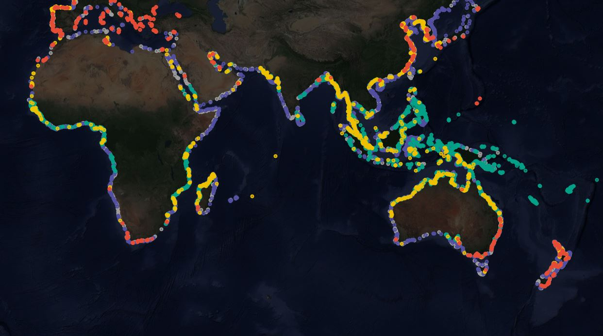

# coastTrain: a global reference library for coastal ecosystems

#### Description
Despite significant recent advances in cloud-based geospatial analysis platforms and free access to immense earth observation archives, global-scale monitoring of many coastal ecosystem types has remained infeasible. This is largely due to the considerable resources required to develop large, analysis-ready, reference datasets suitable for training and testing remote sensing classification models.

coastTrain is open-access training library of coastal ecosystems suitable for training and verifying the latest generation of remote sensing classification models. coastTrain currently consists of >160,000 point features representing confirmed occurrences of 7 coastal ecosystem types. Absence data is also included (permanent water and other terrestrial data) to enable researchers, modellers and conservation organisations to quickly develop maps of the distribution of coastal ecosystem types. 

The developers of coastTrain continually expand its capacity to support coastal ecosystem mapping and conservation. Already, coastTrain includes training data from several high profile coastal mapping projects, including the [Global Tidal Flats](http://intertidal.app), [Global Intertidal Change](https://globalintertidalchange.org), the [Global Mangrove Watch](https://www.globalmangrovewatch.org/) and the [Allen Coral Atlas](https://allencoralatlas.org/). If you are interesting in submitting data to coastTrain, please email Nicholas Murray.

A full description of the methods used to develop coastTrain is available in the published paper.

#### Citation
Use of any aspect of this training requires full attribution (see CC-BY licence). Please cite the published paper:

> Murray, N.J., Lyons, M.B., Bunting, P., Canto, R., Lucas, R., Navarro Otero, A., Roelfsema, C.M., Toor, M., Worthington, T.A. (in submission) coastTrain: a global reference library for coastal ecosystems. *Remote Sensing*

*coastTrain: a global reference library for coastal ecosystems* 


#### Licence
This software is licensed under a Creative Commons Attribution-Non Commercial 4.0 International License. [CC BY-NC 4.0](https://creativecommons.org/licenses/by-nc/4.0/)

#### Maintainer: 
Nicholas Murray (nicholas.murray@jcu.edu.au).

#### Usage notes
coastTrain is intended to be quickly incorporated into classification models applied to earth observation data. Obtain the latest versioned release of coastTrain in [GeoJSON](https://geojson.org/) format archived on Zenodo at doi: [xxx].

An interactive map of coastTrain is available at the following link:
https://www.globalintertidalchange.org/data-viewer/training-data

coastTrain is a set of point occurrences representing the coastal ecosystem types in the table below. The occurrence records were developed primarily by satellite image interpretation with additional reference to published studies, coastal atlases and any existing dataset. Every point in coastTrain was checked against time-stamped satellite imagery acquired during our reference period for 2014-2016. Each point is appended with an integer value to act as a numeric record for use in classification models. Class definitions broadly follow those developed by the [IUCN Global Ecosystem Typology](https://global-ecosystems.org/). Please see the published paper for further information.

| Ecosystem type                     | Class Value | IUCN Realm                    | IUCN Biome          | IUCN Code | IUCN Ecosystem Functional Group  (link)                                   |
| ---------------------------------- | :----:| :---------------------------- | :------------- | :-:   | :-------------------------------------------------------------------------------------- | 
| Terrestrial other (non-intertidal) |   `0` | N/A                           | N/A            | N/A   | N/A                                                                                     | 
| Permanent water                    |   `1` | N/A                           | N/A            | N/A   | N/A                                                                                     | 
| Tidal flat                         |   `2` | Marine-Terrestrial            | Shorelines     | MT1.2 | [Muddy Shorelines](https://global-ecosystems.org/explore/groups/MT1.2)                  |
| Mangroves                          |   `3` | Marine-Freshwater-Terrestrial | Brackish tidal | MFT1.2| [Intertidal forests and shrublands](https://global-ecosystems.org/explore/groups/MFT1.2)|
| Coral reef                         |   `4` | Marine                        | Marine shelf   | M1.3  | [Photic coral reefs](https://global-ecosystems.org/explore/groups/M1.3)                 |
| Saltmarsh / tidal marsh            |   `5` | Marine-Freshwater-Terrestrial | Brackish tidal | MFT1.3| [Coastal saltmarshes and reedbeds](https://global-ecosystems.org/explore/groups/MFT1.3) |
| Seagrass                           |   `6` | Marine                        | Marine shelf   | M1.1  | [Seagrass meadows](https://global-ecosystems.org/explore/groups/M1.1)                   |
| Rocky intertidal                   |   `9` | Marine-Terrestrial            | Shorelines     | MT1.1 | [Rocky Shorelines](https://global-ecosystems.org/explore/groups/MT1.1)                  |
| Kelp forests                       |  `10` | Marine                         | Marine shelf   | M1.2  | [Kelp forests](https://global-ecosystems.org/explore/groups/M1.2)                       |

Every occurrence record in coastTrain includes the following attributes.

```
{
	"type": feature,
	"ID": 1,
	"Lat": 37.607358205897143,
	"Lon": -122.114158970611470,
	"Class": 2,
	"Method": "image interpretation",
	"Scale": 30,
	"IUCN_Realm": "Marine-Terrestrial",
	"IUCN_Biome": "Shorelines Biome",
	"IUCN_Funct": "Muddy Shorelines",
	"IUCN_FunGC": "MT1.2",
	"Reference Data Start": 2014,
	"Reference Data End": 2016,
	"Project Ref": "GIC"
}
```

#### Acknowledgements
coastTrain was developed with an ARC Discovery Early Career Researcher Grant to Murray (DE190100101).

#### Example publications
Below is a set of papers that have used or supplied data to coastTrain.

*Coral reefs*
> Roelfsema, C.M., Lyons, M., Murray, N.J., Kovacs, E.M., Kennedy, E., Markey, K., Borrego-Acevedo, R., Ordonez Alvarez, A., Say, C., Tudman, P., Roe, M., Wolff, J., Traganos, D., Asner, G.P., Bambic, B., Free, B., Fox, H.E., Lieb, Z., & Phinn, S.R. (2021) Workflow for the generation of expert-derived training and validation data: A view to global scale habitat mapping. Frontiers in Marine Science. (https://doi.org/10.3389/fmars.2021.643381)

> Lyons, M., C. Roelfsema, E. Kovacs, R. Borrego, E. Kennedy, K. Markey, M. Roe, D. Yuwono, D. Harris, S. Phinn, J. Li, D. Knapp, K. Larsen, D. Traganos, G. P. Asner, Murray, N.J. (2020) Mapping the world's coral reefs using a global multiscale earth observation framework. Remote Sensing in Ecology and Conservation. (https://doi.org/10.1002/rse2.157) 

*Mangroves*
>Bunting, P., Rosenqvist, A., Lucas, R., Rebelo, L.-M., Hilarides, L., Thomas, N., . . . Finlayson, C. (2018). The Global Mangrove Watch—A new 2010 global baseline of mangrove extent. Remote Sensing, 10(10), 1669. Retrieved from http://www.mdpi.com/2072-4292/10/10/1669

>Bunting, P., Rosenqvist, A., Hilarides, L., Lucas, R. M., & Thomas, N. (2022). Global Mangrove Watch: Updated 2010 Mangrove Forest Extent (v2.5). Remote Sensing, 14(4), 1034. (https://www.mdpi.com/2072-4292/14/4/1034)

*Tidal flats*
> Murray, N.J., Phinn, S., Clinton, N., DeWitt, M., Ferrari, R., Johnston, R., Lyons, M.B., Thau, D., Fuller, R.A. (2019) The global distribution and trajectory of tidal flats. Nature. 565, 222-225 http://dx.doi.org/10.1038/s41586-018-0805-8.

#### Version notes
`version 0.1` initial pre-release
